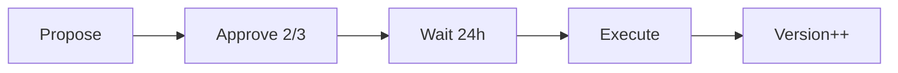

# Upgradeable NFT Certificate Contract

## Overview

The Web3-Student-Lab certificate contract now supports secure, admin-controlled upgrades while preserving all existing NFT certificates and metadata.

## Quick Start

### Check Current Version
```bash
soroban contract invoke --id <CONTRACT_ID> -- get_current_version
```

### Propose an Upgrade
```bash
soroban contract invoke --id <CONTRACT_ID> -- propose_upgrade_with_timelock \
  --caller <ADMIN> \
  --new_wasm_hash <WASM_HASH> \
  --changelog "Version 2.0.0: Performance improvements"
```

### Approve and Execute
```bash
# Approve (requires 2-of-3 admins)
soroban contract invoke --id <CONTRACT_ID> -- approve_pending_upgrade --caller <ADMIN_B>

# Wait 24 hours for time-lock...

# Execute
soroban contract invoke --id <CONTRACT_ID> -- execute_pending_upgrade --caller <ADMIN>
```

## Key Features

### 🔒 Security
- **Multi-Signature:** 2-of-3 governance admin approval required
- **Time-Lock:** 24-hour delay for community review
- **Access Control:** Role-based permissions (Owner, Admin, Operator)
- **Event Logging:** Complete audit trail

### 📊 Version Management
- **Version Tracking:** Complete history of all upgrades
- **Rollback:** Emergency rollback to previous versions
- **Changelog:** Detailed upgrade notes stored on-chain

### 🛡️ Safety
- **Data Preservation:** All certificates maintained across upgrades
- **Backward Compatible:** Existing functions unchanged
- **Emergency Procedures:** Fast rollback for critical issues

## Architecture

```
Certificate Contract
├── Core Functions (lib.rs)
│   ├── Certificate management
│   ├── Governance controls
│   └── Upgrade orchestration
├── Upgrade Module (upgrade.rs)
│   ├── Version tracking
│   ├── Time-lock mechanism
│   └── Rollback capability
└── Admin Module (admin.rs)
    ├── Role management
    ├── Permission system
    └── Multi-sig validation
```

## Admin Roles

| Role | Permissions |
|------|-------------|
| **Owner** | Full control: upgrade, rollback, ownership transfer |
| **Admin** | Certificate operations: mint, revoke, update |
| **Operator** | Read-only: verify certificates |

## Upgrade Workflow



## API Reference

### Upgrade Functions

- `propose_upgrade_with_timelock(caller, wasm_hash, changelog)` → proposal_id
- `approve_pending_upgrade(caller)` → void
- `execute_pending_upgrade(caller)` → void
- `cancel_pending_upgrade(caller)` → void
- `emergency_rollback(signer_a, signer_b, version)` → void

### Query Functions

- `get_current_version()` → u32
- `get_version_history()` → Vec<ContractVersion>
- `get_version(version)` → Option<ContractVersion>
- `get_pending_upgrade()` → Option<PendingUpgrade>

### Admin Functions

- `add_admin_with_role(caller, admin, role)` → void
- `remove_admin_role(caller, admin)` → void
- `get_admin_policy(address)` → Option<AdminPolicy>
- `check_permission(address, permission)` → bool
- `transfer_ownership(caller, new_owner)` → void

## Events

All upgrade activities emit events:

- `v1_upgrade_proposed` - New upgrade proposed
- `v1_upgrade_approved` - Admin approved upgrade
- `v1_upgrade_executed` - Upgrade completed
- `v1_upgrade_cancelled` - Upgrade cancelled
- `v1_emergency_rollback` - Emergency rollback performed
- `v1_admin_added` - New admin added
- `v1_admin_removed` - Admin removed
- `v1_ownership_transferred` - Ownership transferred

## Testing

```bash
# Run all tests
cargo test

# Run upgrade tests
cargo test upgrade_tests

# Run admin tests
cargo test admin_tests
```

## Documentation

- **[Implementation Guide](../docs/UPGRADE_IMPLEMENTATION.md)** - Complete technical documentation
- **[Quick Reference](../docs/UPGRADE_QUICK_REFERENCE.md)** - Common commands and operations
- **[Migration Guide](../docs/UPGRADE_MIGRATION_GUIDE.md)** - Upgrade existing contracts
- **[Security Considerations](../docs/CONTRACT_UPGRADE.md)** - Security best practices

## Examples

### Standard Upgrade
```rust
// 1. Propose
let id = contract.propose_upgrade_with_timelock(
    &admin_a,
    &new_wasm_hash,
    &String::from_str(&env, "v2.0.0: Bug fixes")
);

// 2. Approve
contract.approve_pending_upgrade(&admin_b);

// 3. Wait 24 hours...

// 4. Execute
contract.execute_pending_upgrade(&admin_a);
```

### Emergency Rollback
```rust
// Rollback to version 2
contract.emergency_rollback(
    &admin_a,
    &admin_b,
    &2u32
);
```

### Admin Management
```rust
// Add new admin
contract.add_admin_with_role(
    &owner,
    &new_admin,
    &AdminRole::Admin
);

// Check permissions
let can_upgrade = contract.check_permission(
    &address,
    &Permission::Upgrade
);
```

## Security Best Practices

✅ **DO:**
- Test on testnet first
- Use hardware wallets for admin keys
- Keep detailed changelogs
- Monitor events after upgrades
- Maintain rollback plan

❌ **DON'T:**
- Skip time-lock period
- Share admin private keys
- Upgrade without testing
- Ignore community feedback
- Deploy without audit

## Deployment Checklist

- [ ] Build and optimize WASM
- [ ] Upload to network
- [ ] Deploy contract
- [ ] Initialize with 3 governance admins
- [ ] Test upgrade flow on testnet
- [ ] Verify time-lock mechanism
- [ ] Test emergency rollback
- [ ] Document admin keys securely
- [ ] Set up monitoring
- [ ] Prepare incident response plan

## Support

- **Issues:** [GitHub Issues](https://github.com/your-repo/issues)
- **Documentation:** `/docs` directory
- **Tests:** `/contracts/src/tests`
- **Examples:** See test files

## License

Same as parent project.

---

**Version:** 1.0.0  
**Soroban SDK:** 22.0.0  
**Status:** ✅ Production Ready (pending audit)
